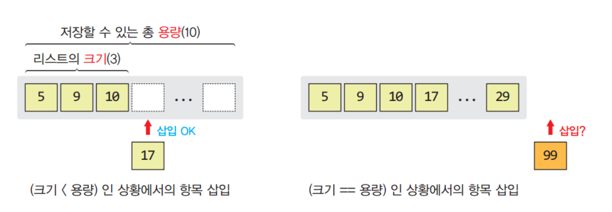
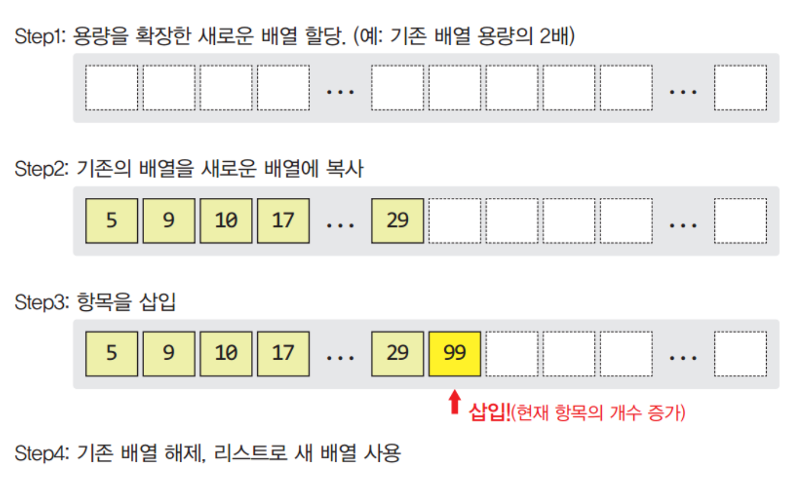
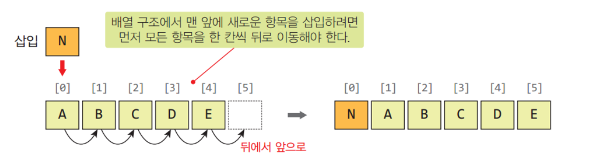
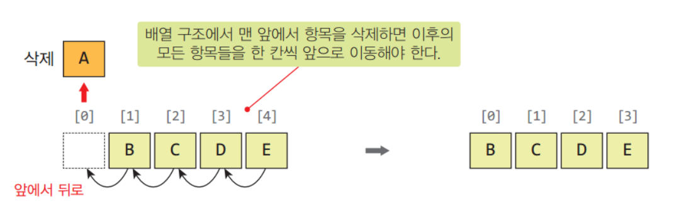
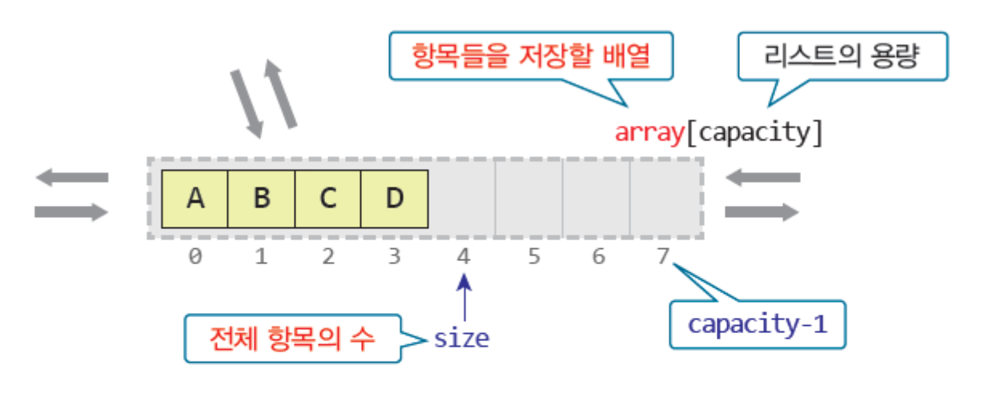
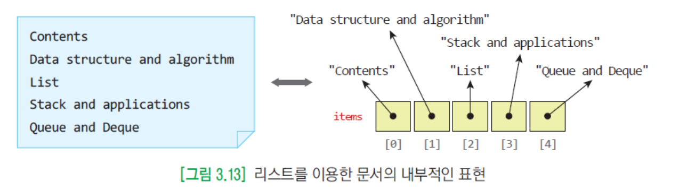
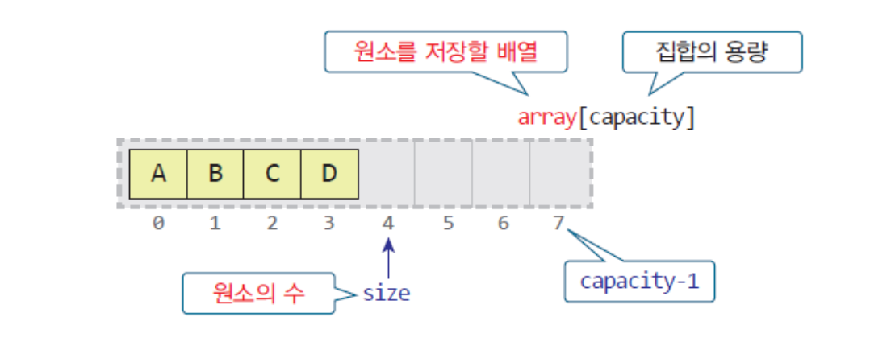

# [3.19] Week 3
### 1. List
* 가장 자유로운 선형 자료구조
* 리스트 , 선형리스트
  * 순서를 가진 항목들의 모임
  * 항목들은 "위치"를 가진다. ~~ 배열처럼..
* 항목들이 순서대로 나열되어있으며, 각 항목들은 위치를 가진다.
* `Stack`,`Queue`, `Deque` 와는 자료의 접근 위치가 다를뿐 유사하다.

### 2. 리스트의 추상 자료형
* 데이터 : 같은 유형의 요소들의 순서 있는 모임
* 연산
    * `insert(pos,e)` : pos위치에 새로운 요소 e를 삽입한다
    * `delete(pos)` : pos위치의 요소를 삭제하고 반환한다.
    * `isEmpty()` : 리스트가 비어있는지 검사한다.
    * `isFull` : 리스트가 가득 차 있는지 검사한다.
    * `getEntry(pos)` : pos위치의 요소를 반환한다.

### 3. Python 리스트
* python의 `list`는 배열 기반이다.
``` python
# 리스트 선언
A = [1,2,3,4,5] 
```
* 파이썬 리스트는 동적 배열이며 배열의 크기를 동적으로 조절한다.



### 4. 연산들의 시간 복잡도
* `append(e)` : 대부분의 경우 O(1)
* `insert(pos,e)` : O(n)

* `pop(pos)` : O(n)


### 5. 리스트 구현

``` python 
class ArrayList :
    # 생성자 및 초기화
    def __init__(self, capacity = 100):
        self.capacity = capacity
        self.array = [None] * capacity
        self.size = 0
    
    #메서드
    def isEmpty(self) :
        return self.size == 0
    
    def isFull(self) :
        return self.size == self.capacity
    
    def getEnty(self,pos) :
        if( 0 <= pos < self.size) :
            return self.array[pos]
        else : 
            return None
    
    def insert(self,pos,e):
        if not self.isFull() and 0 <= pos <= self.size :
            # pos 이후의 요소들을 한칸씩 뒤로 밀어 새로운 요소를 삽입할 공간을 만든다
            for i in range(self.size,pos,-1) :
                self.array[i] = self.array[i-1]
            self.array[pos] = e
            self.size += 1
        else : 
            pass

    def delete(self,pos) :
        if not self.isEmpty() and 0 <= pos < self.size :
            # pos의 요소를 꺼낸다.
            e = self.array[pos] 
            for i in range(pos, self.size-1) :
                self.array[i] = self.array[i+1]
            self.size -= 1
            return e
        else :
            pass

    # LineEditer에서 필요한 메서드
    def getEntry(self, index):
        if 0 <= index < self.size:
            return self.array[index]  # 인덱스의 값 반환
        return None  # 범위 초과 시 None 반환
    
    # 문자열 반환
    def __str__(self):
        return str(self.array[0:self.size])
```

### 6. LineEditer 

```python
from ArrayList import ArrayList

list = ArrayList()

print("LINE EDITTER !\n")
while True :
    command = input("i : 입력 , d : 삭제, r : 변경, p : 출력, l : 파일열기, s : 저장, q : 종료 =>")
    if command == 'i' :
        pos = int(input("행 번호 입력 : "))
        str = input("내용 입력 :")
        list.insert(pos,str)
    elif command == 'd' :
        pos = int(input("행 번호 입력 : "))
        list.delete(pos)
    elif command == 'r' :
        pos = int(input("행 번호 입력 : "))
        re = input("변경할 내용 입력 : ")
        list.insert(pos,str)
    elif command == 'p' :
        for i in range(list.size) :
            print("[ %d] %s" %(i,list.array[i]))
    elif command == 'l' :
        filename = input("  읽어들일 파일 이름: ")
        infile = open(filename , "r")
        lines = infile.readlines();
        for line in lines:
            list.insert(list.size, line.rstrip('\n'))
        infile.close()
    elif command == 's' :
        filename = input("  저장할 파일 이름: ")
        outfile = open(filename , "w")
        len = list.size
        for i in range(len) :
            outfile.write(list.getEntry(i)+'\n')
        outfile.close()
    elif command == 'q' :
        exit()
```

### 7. Set
* 원소의 중복을 허용하지 않음
* 원소들 사이에 순서가 없음 -> 비선형 자료구조

### 8. 집합의 추상 자료형
* 데이터 : 같은 유형의 유일한 요소들의 모임. 순서는 없지만 서로 비교할 수 있어야 한다.
* 연산
  * `contains(e)` : 집합이 원소 e를 가지는지 검사한다. (순차탐색 : O(n))
  * `insert(e)` : 새로운 원소 e를 삽입한다. 중복은 허용하지 않는다. (중복검사 : O(n))
  * `delete(e)` : 원소 e를 삭제하고 반환한다. (탐색: O(n))
  * `isEmpty()` : 공집합인지 검사한다.
  * `isFull()` : 가득 차 있는지 검사한다.
  * `union(setB)` : setB와 합집합을 만들어 반환한다. (O(n^2))
  * `intersect(setB)` : setB와 교집합을 만들어 반환한다. (O(n^2))
  * `difference(setB)` : setB와 차집합을 만들어 반환한다. (O(n^2))

### 9. 집합 구현
* 다양한 방법으로 구현이 가능하다.
  * 배열, 비트 벡터, 트리, 해싱 구조 등...
  * 사용 방법에 따라 연산들의 성능이 달라진다.

``` py
class ArraySet:
    def __init__( self, capacity=100 ):
        self.capacity = capacity
        self.array = [None]*capacity
        self.size = 0

    def isEmpty( self ):
       return self.size == 0

    def isFull( self ):
       return self.size == self.capacity

    def __str__( self ) :
        return str(self.array[0:self.size])

    def contains(self, e) :
        for i in range(self.size) :
            if self.array[i] == e :
                return True
        return False

    def insert(self, e) :
        if not self.contains(e) and not self.isFull() :
           self.array[self.size] = e
           self.size += 1
        else : pass

    def delete(self, e) :
        for i in range(self.size) :
            if self.array[i] == e :
                self.array[i] = self.array[self.size-1]
                self.size -= 1

    def union( self, setB ):
        setC = ArraySet()
        for i in range(self.size) :
            setC.insert(self.array[i])

        for i in range(setB.size) :
            if not setC.contains(setB.array[i]) :
                setC.insert(setB.array[i])

        return setC

    def intersect( self, setB ):            
        setC = ArraySet()
        for i in range(setB.size) :
            if self.contains(setB.array[i]) :
                setC.insert(setB.array[i])
        return setC

    def difference( self, setB ):            
        setC = ArraySet()
        for i in range(self.size) :
            if not setB.contains(self.array[i]) :
                setC.insert(self.array[i])
        return setC
```