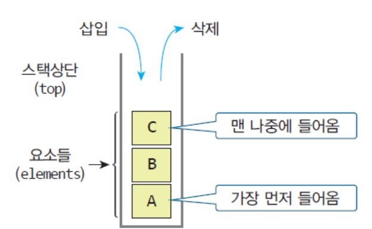
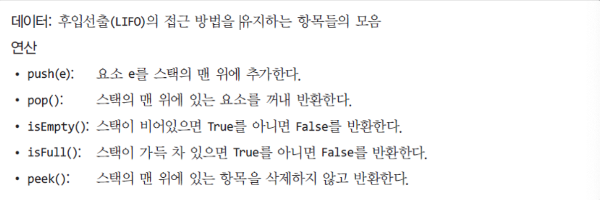
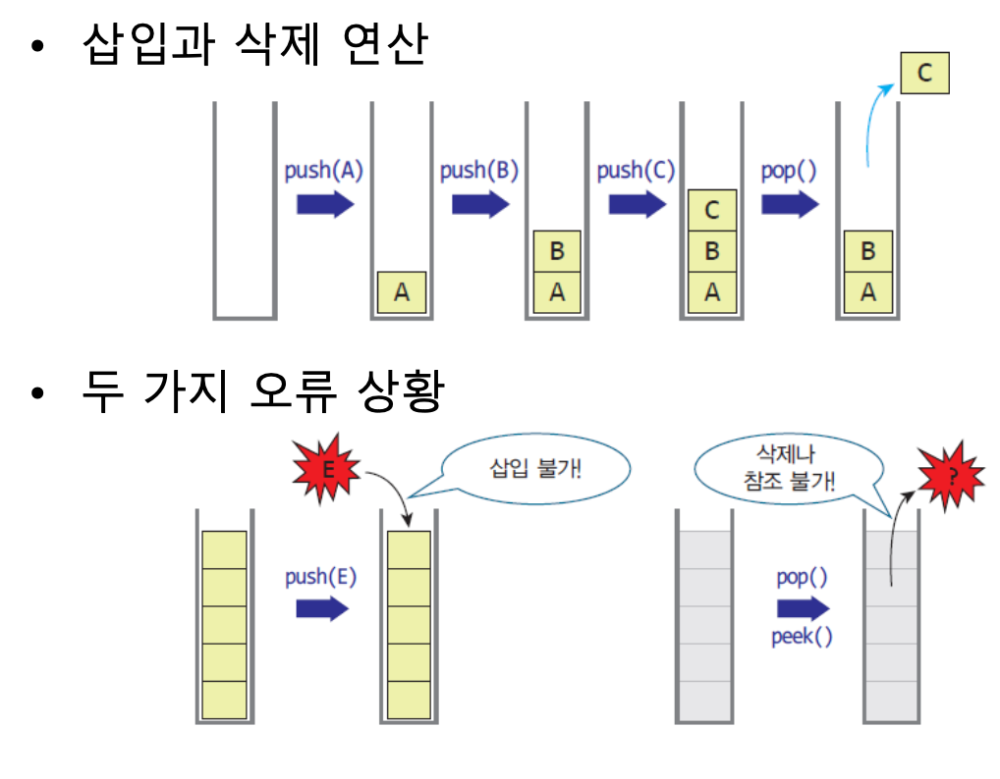
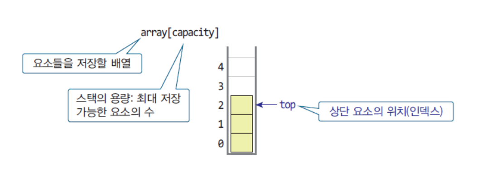
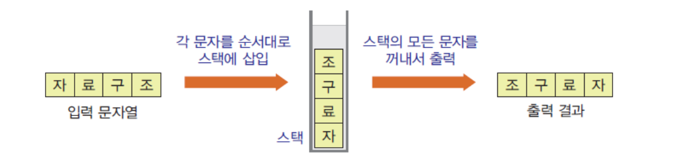

# [3.26] Week 4
### 1. Stack 이란 ?
* Stack : 쌓아놓은 더미
  * 후입선출의 자료구조 (LIFO : Last - In, First - Out)
  * 가장 최근에 들어온 데이터가 가장 먼저 나간다.


-> 자료의 입출력이 상단으로만 가능하다.

### 2. Stack의 추상 자료형과 연산





### 3. Stack의 쓰임
* 편집기의 되돌리기 (Ctrl + Z)
* 브라우저의 이전 페이지로 이동
* 함수 호출 : System Stack
* 괄호 검사
* 계산기 : 후위 표기식 계산
* 미로 탐색 등

### 4. Stack의 구현



``` python
class ArrayStack :
    def __init__(self, capacity) :
        self.capacity = capacity 
        self.array = [None] * capacity
        self.top = -1

    def isEmpty(self) :
        return self.top == -1
    
    def isFull(self) :
        return self.top == self.capacity
    
    def push(self, e) :
        if not self.isFull() :
            self.top += 1
            self.array[self.top] = e
    
    def pop(self) :
        if not self.isEmpty() :
            self.top -= 1
            return self.array[self.top+1]
        
    def peek(self) :
        if not self.isEmpty() :
            return self.array[self.top]
        else : pass
```

### 5. Stack의 쓰임 : 문자열 뒤집기



``` python 
from ArrayStack import ArrayStack

s = ArrayStack(100)             # 스택 객체를 생성

msg = input("문자열 입력: ")    # 문자열을 입력받음
for c in msg :                  # 문자열의 각 문자 c에 대해
    s.push(c)                   # c를 스택에 삽입

print("문자열 출력: ", end='')
while not s.isEmpty():          # 스택이 공백상태가 아니라면
    print(s.pop(), end='')      # 하나의 요소를 꺼내서 출력
print()

```

### 6. Stack의 쓰임 : 괄호 검사
``` python
from ArrayStack import ArrayStack

def checkBrackets(statement):
    stack = ArrayStack(100)
    for ch in statement:
        if ch=='{' or ch=='[' or ch=='(' :
            stack.push(ch)
        elif ch=='}' or ch==']' or ch==')' :
            if stack.isEmpty() :
                return False
            else :
                left = stack.pop()
                if (ch == "}" and left != "{") or \
                   (ch == "]" and left != "[") or \
                   (ch == ")" and left != "(") :
                    return False

    return stack.isEmpty()
```

### 7. Stack의 쓰임 : 후위 계산기
``` python
def evalPostfix( expr ):
    s = ArrayStack(100)
    for token in expr :
        if token in "+-*/" :
            val2 = s.pop()
            val1 = s.pop()
            if   (token == '+'): s.push(val1 + val2)
            elif (token == '-'): s.push(val1 - val2)
            elif (token == '*'): s.push(val1 * val2)
            elif (token == '/'): s.push(val1 / val2)
        else :
            s.push( float(token) )

    return s.pop()

```

### 8. Stack의 쓰임 : 중위수식 -> 후위수식으로 전환
``` python
def precedence (op):
    if   (op=='(' or op==')') : return 0;
    elif (op=='+' or op=='-') : return 1;
    elif (op=='*' or op=='/') : return 2;
    else : return -1

def Infix2Postfix( expr ):
    s = ArrayStack(100)
    output = []

    for term in expr :
        if term in '(' :
            s.push('(')

        elif term in ')' :
            while not s.isEmpty() :
                op = s.pop()
                if op=='(' :
                    break;
                else :
                    output.append(op)

        elif term in "+-*/" :
            while not s.isEmpty() :
                op = s.peek()
                if( precedence(term) <= precedence(op)):
                    output.append(op)
                    s.pop()
                else: break
            s.push(term)

        else :                  # 피연산자
            output.append(term)

    while not s.isEmpty() :
        output.append(s.pop())

    return output
```

### 9. Stack의 쓰임 : 미로 탐색
``` python
from ArrayStack import ArrayStack

# 미로 구현
map =[[ '1', '1', '1', '1', '1', '1' ],
	  [ 'e', '0', '0', '0', '0', '1' ],
	  [ '1', '0', '1', '0', '1', '1' ],
	  [ '1', '1', '1', '0', '0', 'x' ],
	  [ '1', '1', '1', '0', '1', '1' ],
	  [ '1', '1', '1', '1', '1', '1' ]]
MAZE_SIZE = 6

# 갈 수 있는 위치인지 확인
def isValidPos(x, y) :	
    if 0 <= x < MAZE_SIZE and 0 <= y < MAZE_SIZE :
        if map[y][x] == '0' or map[y][x] == 'x':
            return True
    return False

def DFS() :			
    print('DFS: ')
    stack = ArrayStack(100)	
    stack.push((0,1))	

    while not stack.isEmpty(): 	 
        here = stack.pop()      
        print(here, end='->')
        (x,y) = here

        if (map[y][x] == 'x') :	
            return True
        else :
            map[y][x] = '.'	
            if isValidPos(x, y - 1): stack.push((x, y - 1)) # 상
            if isValidPos(x + 1, y): stack.push((x + 1, y)) # 우
            if isValidPos(x, y + 1): stack.push((x, y + 1)) # 하
            if isValidPos(x - 1, y): stack.push((x - 1, y)) # 좌
        print(' 현재 스택: ', stack)
    return False
```